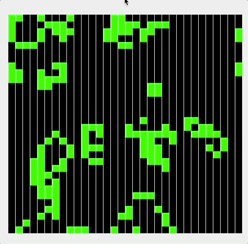

# assignment-game-of-life



The [Game of Life](https://en.wikipedia.org/wiki/Conway%27s_Game_of_Life) is a game with just a couple rules and no
players.

You can read more about the rules and origins of the game from the wiki, but it boils down to a couple rules:

1. Any live cell with fewer than two live neighbours dies, as if by underpopulation.
2. Any live cell with two or three live neighbours lives on to the next generation.
3. Any live cell with more than three live neighbours dies, as if by overpopulation.
4. Any dead cell with exactly three live neighbours becomes a live cell, as if by reproduction.

This can be nicely described in Java with our new knowledge of if-statements.

## Usage

Upon completion, you should be able to run the Java swing application and see the game in action.

### Windows

```shell
> .\gradlew clean
> .\gradlew jar
> java -jar build\libs\game-of-life-0.1.0.jar
```

### MacOS

```shell
$ ./gradlew clean
$ ./gradlew jar
$ java -jar build/libs/game-of-life-0.1.0.jar
```

## To Do

This project has 3 subproblems you need to solve.

### Cell Rule

You need to implement [CellRule](./src/main/java/edu/fcc/cmis/life/game/CellRule.java) with the correct rules for death
and rebirth. The rules (repeated) are:

1. Any live cell with fewer than two live neighbours dies, as if by underpopulation.
2. Any live cell with two or three live neighbours lives on to the next generation.
3. Any live cell with more than three live neighbours dies, as if by overpopulation.
4. Any dead cell with exactly three live neighbours becomes a live cell, as if by reproduction.

### Border Rule

Conway's Game of Life assumes that the game takes place on an **infinite** board. For simplicity, we will take a finite
board. To handle the borders, we are choosing to **wrap** around the edges as if they were connected. This is
implemented in [BorderRule](./src/main/java/edu/fcc/cmis/life/game/BorderRule.java).

In other words, given a max dimension `N`:

1. if my position is less than zero then move to `N-1`
2. if my position is greater than or equal to `N` then move to `0`
3. if (1) or (2) or not met, then use the original position

### Color Rule

This is to add your own spice to the program. My demo has green/black, but you can choose your own colors.

To choose your colors, you need to modify [CellColorPicker](./src/main/java/edu/fcc/cmis/life/ui/CellColorPicker.java).

The **only rule** is that the `ALIVE` and `DEAD` state should be different colors.